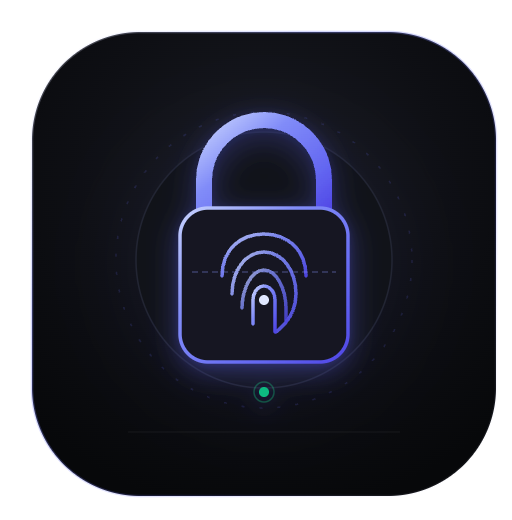

# <p align="center"><br>VaultNote</p>

<p align="center">
  <strong>Your secrets. Your device. No cloud required.</strong>
</p>

<p align="center">
  <a href="#key-features">Features</a> •
  <a href="#why-vaultnote">Why VaultNote</a> •
  <a href="#security-architecture">Security Architecture</a> •
  <a href="docs/architecture.md">Architecture Guide</a> •
  <a href="#technology-stack">Tech Stack</a> •
  <a href="#getting-started">Getting Started</a> •
  <a href="#threat-model">Threat Model</a> •
  <a href="#contributing">Contributing</a> •
  <a href="#license">License</a>
</p>

<p align="center">
  <a href="LICENSE"></a>
  
  
  
  
  
  <a href="CONTRIBUTING.md"></a>
  <a href="CODE_OF_CONDUCT.md"></a>
</p>

---

## Overview

**VaultNote** is a production-quality, open-source, offline-first personal vault for mobile devices (iOS & Android). It is built for individuals who demand uncompromising privacy, zero-knowledge architecture, and total control over their credentials, notes, and cryptographic secrets.

VaultNote operates **100% offline**:
- **No required cloud backend**
- **No user accounts or remote registration**
- **No tracking, telemetry, or analytics services**
- **No network transmission of sensitive material**

---

## Why VaultNote?

Most password managers today operate as cloud services. While convenient, centralized vaults present significant risks: remote data breaches, provider outages, vendor lock-in, and constant background telemetry.

VaultNote returns full sovereignty to the user:
1. **Local Enclave Security**: Cryptographic keys are anchored directly in hardware-backed secure enclaves (iOS Keychain / Android Keystore).
2. **True Zero-Knowledge**: Your master password is never stored anywhere, unhashed or hashed.
3. **Air-Gapped by Design**: The app functions completely without network connectivity, preventing remote exfiltration vectors.
4. **Transparent & Auditable**: Open-source codebase designed to be audited by security researchers.

---

## Key Features

### 🔐 Multi-Category Secret Management
Securely store and organize diverse sensitive assets:
- **Website & App Logins**: Usernames, passwords, domains, auto-fill tags, and integrated TOTP.
- **RFC 6238 TOTP Authenticator**: Built-in 2FA authenticator with animated countdown rings, local clock drift tolerance, and 30-second cadence.
- **Encrypted Secure Notes**: Markdown notes with formatting, checklists, network configuration blocks, and zero-index search policies.
- **Payment Cards**: Credit, debit, and virtual card numbers with encrypted CVV and PIN protection.
- **API Keys & Developer Tokens**: Monospace display for SSH keys, bearer tokens, and cloud secrets.
- **Identity Documents**: Passports, driver's licenses, and national IDs.
- **Recovery Codes**: Dedicated storage for one-time multi-factor recovery codes.

### 🛡️ Hardware-Grade Security & Vault Lifecycle
- **Biometric Authentication**: Rapid biometric unlock via Face ID, Touch ID, or Android BiometricPrompt backed by hardware security enclaves.
- **Per-Item Protection**: Require explicit biometric authentication before revealing or copying sensitive fields on high-risk items.
- **Configurable Auto-Lock**: Automatic vault locking upon app backgrounding or inactivity (Immediate, 30s, 1m, 5m).
- **Clipboard Sanitizer**: Decrypted secrets copied to the system clipboard automatically wipe after 30 seconds.
- **Anti-Snapshot Cloak**: Masks the app window in system task switchers and prevents visual screen capture leaks.
- **Emergency Recovery Kit**: 24-word BIP-39 mnemonic phrase generation with printable export and self-audit verification.
- **Duress Vault**: Optional decoy workspace configuration for coercion resistance.

### ⚡ Fast Local Search & Ephemeral Indexing
- Instant full-text search across item titles, usernames, websites, and tags.
- **Zero-Knowledge Ephemeral RAM Index**: Searches decrypt only in volatile memory—no unencrypted search indices or cache are ever persisted to disk.

### 🩺 Security Health Audit
- Real-time vault hygiene score (0–100) assessing password entropy, reuse, and 2FA coverage.
- Offline leak detection comparing credentials against local hash tables with zero network calls.

### 💾 Backup & Data Sovereignty
- **Encrypted Export (`.vaultnote`)**: Tamper-evident authenticated backups encrypted with AES-256-GCM and unique Argon2id key derivation parameters.
- **Import Support**: Migration tools for importing existing vaults from 1Password, Bitwarden, and KeePass.

---

## Security Architecture

VaultNote implements a multi-tier cryptographic key hierarchy to ensure that ciphertext remains inaccessible without the master password or hardware-enclave biometric release.

```text
               Master Password
                      │
                      ▼
           Argon2id Key Derivation
          (m=64MB, t=4, p=4, Salt)
                      │
                      ▼
          Key Encryption Key (KEK)
                      │
                      ▼
         Unwraps via AES-256-KW / GCM
                      │
                      ▼
          Vault Encryption Key (VEK)
                      │
                      ▼
    AES-256-GCM Authenticated Encryption
    (Unique 96-bit Nonce per item/payload)
                      │
                      ▼
           Local Encrypted SQLite DB
```

### Cryptographic Principles
- **No Custom Cryptography**: All cryptographic operations leverage vetted, standard implementations (Argon2id, AES-GCM, CSPRNG).
- **Key Separation**: The Master Password derives a Key Encryption Key (KEK). The Vault Encryption Key (VEK) is generated using a CSPRNG and encrypted with the KEK. This allows changing the master password without re-encrypting the entire vault.
- **Authenticated Encryption**: AES-256-GCM guarantees both confidentiality and integrity, detecting any payload tampering.
- **Secure Key Storage**: Keys are held in RAM only while the vault is in the `UNLOCKED` state and are aggressively purged upon `LOCKED` or `BACKGROUND` transitions.

---

## Technology Stack

| Layer | Technology |
|---|---|
| **Framework** | [React Native](https://reactnative.dev/) (0.86+) & [Expo](https://expo.dev/) (SDK 57) |
| **Language** | [TypeScript](https://www.typescriptlang.org/) (Strict Mode) |
| **Routing** | [Expo Router](https://docs.expo.dev/router/introduction/) |
| **State Management** | [Zustand](https://github.com/pmndrs/zustand) |
| **Persistence** | [expo-sqlite](https://docs.expo.dev/versions/latest/sdk/sqlite/) |
| **Secure Key Storage**| [expo-secure-store](https://docs.expo.dev/versions/latest/sdk/securestore/) (Keychain / Keystore) |
| **Biometrics** | [expo-local-authentication](https://docs.expo.dev/versions/latest/sdk/local-authentication/) |
| **Forms & Validation**| [React Hook Form](https://react-hook-form.com/) & [Zod](https://zod.dev/) |
| **Testing** | [Jest](https://jestjs.io/), [React Native Testing Library](https://callstack.github.io/react-native-testing-library/), [Maestro](https://maestro.mobile.dev/) |

---

## Architecture & Codebase Structure

VaultNote follows a modular, feature-oriented clean architecture:

$$\text{UI Layer} \longrightarrow \text{Custom Hooks} \longrightarrow \text{Use Cases} \longrightarrow \text{Domain Services} \longrightarrow \text{Repositories} \longrightarrow \text{Encrypted Storage}$$

```text
apps/
└── mobile/
    ├── app/                              # Expo Router file-based navigation
    │   ├── _layout.tsx                   # Root layout, providers & session guards
    │   ├── index.tsx                     # Entrypoint & lock redirection
    │   ├── (auth)/                       # Authentication & onboarding routes
    │   │   ├── setup.tsx                 # Master password & enclave initialization
    │   │   ├── unlock.tsx                # Biometric & password unlock screen
    │   │   └── recovery.tsx              # BIP-39 emergency kit restoration
    │   └── (vault)/                      # Authenticated vault routes
    │       ├── _layout.tsx               # Main navigation & bottom tabs
    │       ├── index.tsx                 # Vault home dashboard
    │       ├── search.tsx                # Ephemeral search screen
    │       ├── favorites.tsx             # Starred & pinned items hub
    │       ├── item/
    │       │   ├── new.tsx               # Add secret modal / selector
    │       │   └── [id].tsx              # Detail view, mask & unmask
    │       └── settings/
    │           ├── index.tsx             # Settings overview
    │           ├── security.tsx          # Security center & policy controls
    │           └── backup.tsx            # Export, import & recovery tools
    └── src/
        ├── features/                     # Feature modules
        │   ├── authentication/           # Master password, unlock & session
        │   ├── vault/                    # Item CRUD, indexing, schemas
        │   ├── totp/                     # RFC 6238 engine & countdown timers
        │   ├── password-generator/       # CSPRNG generator & entropy scoring
        │   ├── search/                   # In-memory query evaluation
        │   ├── security-center/          # Hygiene scoring & breach auditing
        │   └── backup/                   # Encrypted serialization & export
        ├── core/                         # Low-level infrastructure & singletons
        │   ├── crypto/                   # Argon2id, AES-GCM, CSPRNG primitives
        │   ├── database/                 # SQLite connection & migrations
        │   ├── storage/                  # Platform SecureStore bridge
        │   ├── biometric/                # Local authentication wrapper
        │   ├── clipboard/                # Auto-expiring clipboard manager
        │   └── session/                  # VaultSessionManager state machine
        ├── components/                   # Design system primitives & components
        ├── theme/                        # Design tokens (colors, spacing, typography)
        └── types/                        # Global domain models & contracts
```

---

## Design System & UI Principles

VaultNote is designed to feel like **Apple Notes + 1Password + Linear**:
* **Theme**: Deep obsidian palette (`#0D0E11` / `#121214`), dark elevated surfaces (`#1A1B1F`), and crisp borders (`#2A2B32`).
* **Accents**: Subtle lavender/purple primary (`#7B61FF`), emerald security indicators (`#10B981`), and warning amber (`#F59E0B`).
* **Typography**: Monospace accents for tokens, keys, and hashes; clean sans-serif typography with strict hierarchy.
* **Micro-interactions**: Smooth transitions, tactile haptic feedback, and clear visual state indicators.

---

## Getting Started

### Prerequisites
- [Node.js](https://nodejs.org/) (v18 or higher recommended)
- [npm](https://www.npmjs.com/) or [yarn](https://yarnpkg.com/)
- [Expo CLI](https://docs.expo.dev/get-started/installation/)
- iOS: macOS with Xcode and CocoaPods (for iOS Simulator or native build)
- Android: Android Studio & Android SDK (for Android Emulator)

### Installation

1. **Clone the repository**:
   ```bash
   git clone https://github.com/deadlium/vault-note.git
   cd vault-note
   ```

2. **Install dependencies**:
   ```bash
   npm install
   ```

3. **Start the development server**:
   ```bash
   npm run start
   ```

4. **Launch on a target platform**:
   - **iOS Simulator**: Press `i` in the Expo terminal or run `npm run ios`
   - **Android Emulator**: Press `a` in the Expo terminal or run `npm run android`
   - **Expo Go / Physical Device**: Scan the terminal QR code with the Expo Go app or a development build.

---

## Testing

Quality and security testing are paramount for VaultNote:

```bash
# Run unit and cryptographic tests
npm test

# Run test suite with coverage report
npm test -- --coverage

# Typecheck with strict TypeScript
npm run typecheck

# Lint codebase
npm run lint
```

### End-to-End (E2E) Testing
E2E user flows (vault creation, biometric unlock, credential entry, TOTP verification, and emergency recovery) are automated with [Maestro](https://maestro.mobile.dev/):

```bash
maestro test .maestro/vault-lifecycle.yaml
```

---

## Threat Model & Security Boundaries
<a id="threat-model"></a>

A detailed threat model is maintained in [docs/threat-model.md](docs/threat-model.md).

### Threats Mitigated
- **Device Theft / Physical Database Extraction**: Data at rest is encrypted with AES-256-GCM using keys never written to disk unencrypted.
- **Stolen Backups**: Backups are independently encrypted with unique key derivation salts.
- **Clipboard Snooping**: Sensitive fields copied to the clipboard are purged automatically after 30 seconds.
- **Application Switcher Snooping**: Anti-snapshot cloaking prevents background snapshots from capturing plaintext secrets.
- **Offline Brute-Force Attacks**: Argon2id parameters enforce substantial memory and computation costs per guess.

### Known Limitations & Out-of-Scope Risks
- **Compromised Operating System**: Jailbroken or rooted devices with kernel-level malware or active keyloggers can compromise memory safety.
- **Hardware-Level Extraction**: Extremely sophisticated hardware attacks bypassing the Secure Enclave are outside mobile app mitigation capabilities.
- **Social Engineering**: User disclosure of master passwords or recovery seeds cannot be prevented by software alone.

---

## Security Reporting

If you discover a security vulnerability or potential cryptographic flaw in VaultNote, please review our [SECURITY.md](SECURITY.md) guidelines and contact our security team directly at **security@vaultnote.app** (or via our encrypted PGP key) rather than opening a public issue.

---

## Contributing

We welcome contributions from privacy advocates, developers, and security auditors! Please read our [CONTRIBUTING.md](CONTRIBUTING.md) and [CODE_OF_CONDUCT.md](CODE_OF_CONDUCT.md) before submitting pull requests.

---

## License

VaultNote is licensed under the [MIT License](LICENSE).
Copyright &copy; 2026 VaultNote Contributors.

